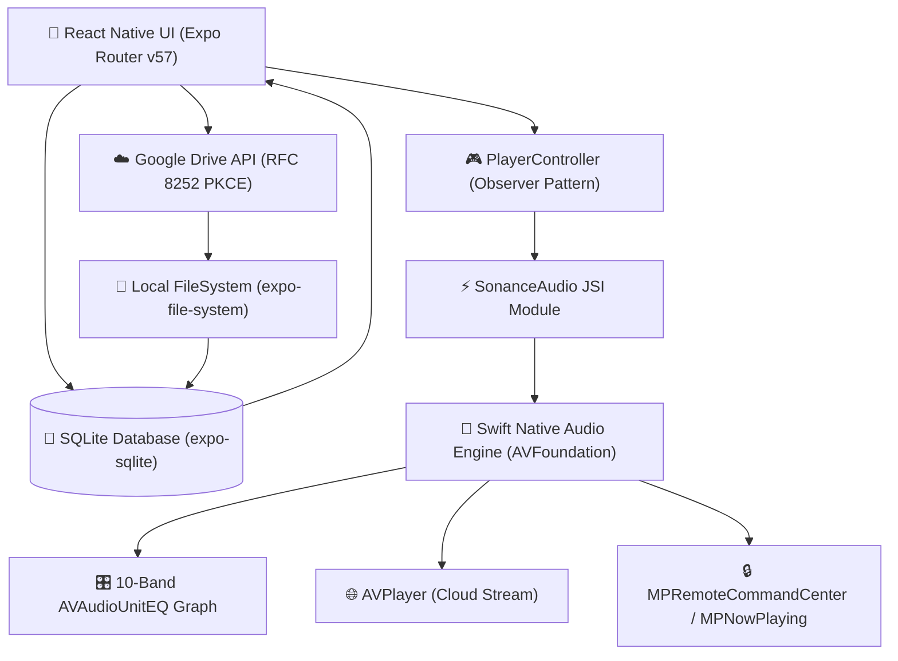
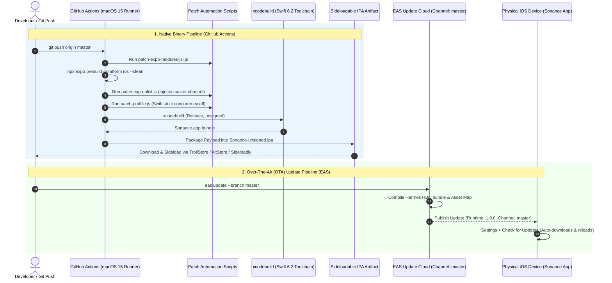

# Sonance Player: Comprehensive Architecture & CI/CD Pipeline Audit

**Version:** 1.0.0  
**Target Platform:** iOS (Expo SDK 57 / Swift 6.2+ Native Engine)  
**Distribution:** Unsigned Sideloadable IPA & EAS Over-The-Air (OTA) Updates  
**Repository:** `https://github.com/LynxeDev2005/sonanceplayer`

---

## 1. System Overview & Architecture

Sonance is an audiophile-grade offline and cloud music player engineered with a **hybrid architecture**: a high-performance **Swift 6.2 native audio engine** running `AVAudioEngine` / `AVAudioUnitEQ` under the hood, paired with an **Expo SDK 57 (React Native 0.86)** glassmorphic UI layer.



---

## 2. Directory Structure Blueprint

```text
player-sonance/
├── .github/
│   └── workflows/
│       └── build-ipa.yml           # GitHub Actions macOS CI/CD pipeline for unsigned IPA
├── app/                            # Expo Router File-Based Routing
│   ├── (tabs)/
│   │   ├── _layout.tsx             # Custom floating glass tab bar layout
│   │   ├── index.tsx               # Library (Tracks list, instant search, quick play)
│   │   ├── playlists.tsx           # Custom playlists & smart playlist manager
│   │   ├── search.tsx              # Deep library search & filter
│   │   └── settings.tsx            # Equalizer, audio settings & OTA Update Checker
│   ├── _layout.tsx                 # Root layout, database & session initialization
│   ├── drive.tsx                   # Google Drive cloud browser, online stream & downloader
│   ├── equalizer.tsx               # Interactive 10-band equalizer with VLC presets
│   ├── import.tsx                  # File importer & recursive auto-scan folder
│   └── player.tsx                  # Fullscreen Now Playing player with gestures
├── assets/                         # Vector icons, splash screens, and Sonance logos
├── modules/
│   └── sonance-audio/              # Custom Swift Native Expo Audio Module
│       ├── ios/
│       │   ├── SonanceAudio.podspec
│       │   ├── SonanceAudioEngine.swift   # AVFoundation + AVAudioEngine + 10-Band EQ
│       │   └── SonanceAudioModule.swift   # Expo Swift JSI Bridge & Event Dispatcher
│       └── src/
│           ├── index.ts                   # TypeScript API & metadata extraction exports
│           └── SonanceAudio.types.ts      # TrackInfo, PlaybackState & Equalizer types
├── scripts/                        # Automated Build & Patch Scripts
│   ├── patch-expo-modules-jsi.js   # Swift 6.2 concurrency & pointer compatibility patches
│   ├── patch-expo-plist.js         # Injects EAS master update channel into Expo.plist
│   └── patch-podfile.js            # Injects strict concurrency suppressions into Podfile
├── src/
│   ├── components/                 # Glassmorphic UI Components
│   │   ├── GlassCard.tsx           # Blur-backed cards
│   │   ├── GlassTabBar.tsx         # Liquid bottom navigation
│   │   ├── MiniPlayer.tsx          # Persistent bottom playback bar
│   │   ├── TrackRow.tsx            # Optimized track row with action triggers
│   │   └── TrackActionModal.tsx    # Add to playlist, view info, delete sheet
│   ├── data/
│   │   ├── database.ts             # SQLite schema, atomic transactions & queries
│   │   ├── equalizerPresets.ts     # 18 VLC-accurate 10-band equalizer presets
│   │   └── storage.ts              # FileSystem storage directory & artwork caching
│   ├── player/
│   │   ├── PlayerController.ts     # Central playback controller & observer pub/sub
│   │   └── hooks.ts                # React hooks for playback state synchronization
│   ├── services/
│   │   ├── GoogleDriveService.ts   # OAuth 2.0 PKCE, session cache, cloud streaming & download
│   │   └── ImportService.ts        # 6-worker concurrency pool, duplicate pre-filter & recursive walker
│   └── theme/                      # Design system (colors, typography, radii, shadows)
├── app.json                        # Expo configuration, plugins, URL schemes & EAS settings
├── eas.json                        # EAS Update and build configuration
└── package.json                    # Dependencies and build scripts
```

---

## 3. Core Subsystems & How They Work

### A. Swift Native Audio Engine (`modules/sonance-audio`)
- **VLC-Accurate 10-Band DSP Equalizer:** Uses `AVAudioEngine`, `AVAudioPlayerNode`, and a 10-band `AVAudioUnitEQ` node connected to `mainMixerNode`.
  - **Center Frequencies:** `32 Hz`, `60 Hz`, `125 Hz`, `250 Hz`, `500 Hz`, `1 kHz`, `2 kHz`, `4 kHz`, `8 kHz`, `16 kHz`.
  - **Filter Types:** Band 0 uses `.lowShelf`, bands 1–8 use `.parametric`, band 9 uses `.highShelf`.
  - **Preamp Gain:** Global volume compensation $(-20\text{ dB}$ to $+20\text{ dB})$.
- **Hybrid Playback Pipeline:**
  - **Local Files (`file://`):** Routed through `AVAudioEngine` for real-time DSP equalizing, sample-accurate scrubbing, and lossless local rendering.
  - **Remote / Cloud Streams (`https://`):** Routed through `AVPlayer` with progressive buffering and instant playback.
- **Lock Screen & Background Control:** Native integration with `MPRemoteCommandCenter` (play, pause, next, previous, scrub position) and `MPNowPlayingInfoCenter` (metadata, artwork, duration, elapsed time).
- **Interruption & Route Handling:** Automatically pauses audio when headphones or Bluetooth disconnects (`AVAudioSession.routeChangeNotification`) and recovers from phone calls (`AVAudioSession.interruptionNotification`).

---

### B. SQLite Database & Local Storage (`src/data`)
- **Engine:** `expo-sqlite` (Synchronous JSI API via `openDatabaseSync`).
- **Database Schema:**
  - `tracks`: Track ID, title, artist, album, duration, file path, artwork path, added timestamp.
  - `playlists`: Playlist ID, playlist name, creation timestamp.
  - `playlist_tracks`: Relational junction table with composite key and `order_index`.
  - `history`: Playback history with auto-incrementing log ID.
  - `equalizer_settings`: Current equalizer preset, preamp, and 10-band JSON values.
- **Atomic Batch Commit (`insertTracksBatch`):** Uses `db.withTransactionSync` to insert hundreds of tracks in a single SQLite transaction ($< 15\text{ ms}$).
- **Defensive Error Handling:** All queries wrapped in fallback blocks preventing crashes on schema changes.

---

### C. Turbo Importing & Recursive Auto-Scan (`src/services/ImportService.ts`)
- **6-Worker Concurrency Pool (`runConcurrentPool`):** Processes up to 6 audio tracks in parallel, maximizing multi-core iOS performance without freezing the JavaScript thread.
- **Instant $O(1)$ Duplicate Avoidance:** Computes sets of existing file names and normalized titles (`normalizeString`). Discovered duplicates are skipped upfront in memory.
- **Recursive Directory Walker (`scanFolderAndImport`):** Traverses nested directory hierarchies (e.g., `Artist/Album/Track.flac`) from iOS Files and iCloud Drive.
- **Supported Formats:** `.mp3`, `.flac`, `.m4a`, `.wav`, `.aac`, `.ogg`, `.aiff`, `.alac`, `.opus`.
- **Native Metadata Extraction:** Uses native `AVURLAsset` to extract title, artist, album, duration, and embedded ID3/APEv2 album artwork thumbnails.

---

### D. Google Drive Cloud Integration (`src/services/GoogleDriveService.ts`)
- **RFC 8252 PKCE OAuth 2.0 Compliance:**
  - Uses `AuthSession.ResponseType.Code` with `usePKCE: true`.
  - Redirect URI uses iOS reversed Client ID scheme: `com.googleusercontent.apps.146606044771-gf8g6dth3aagjdo8m56ofrqs07k3ifq1:/oauthredirect`.
  - Registered under `CFBundleURLSchemes` in `app.json`.
- **Persistent Session Storage:** Session tokens, user profile, and client ID are cached to `gdrive_session.json` in local storage. Sessions auto-restore on app startup with zero re-login prompts.
- **Online Cloud Streaming vs Offline Downloading:**
  - **Online Stream (▶️):** Generates direct authorized stream URLs (`alt=media&access_token=...`) played instantly via `AVPlayer`.
  - **Offline Download (⬇️):** Multi-threaded background downloading into local storage with metadata extraction and library indexing.
  - **Live Badges:** Displays `Offline (In Library)` (green) or `Cloud Stream` (blue) per track.

---

## 4. CI/CD & Build Pipelines



### A. GitHub Actions Native Build Pipeline (`.github/workflows/build-ipa.yml`)
1. **Environment:** macOS 15 runner selecting Xcode with Swift 6.2+ compiler.
2. **Swift 6.2 Compatibility Patch (`patch-expo-modules-jsi.js`):**
   - Strips obsolete `SWIFT_RETURNS_RETAINED` in `RuntimeScheduler.h`.
   - Wraps unsafe raw pointers (`thisPtr`, `argumentsPtr`, `resultPtr`) in `NonisolatedUnsafeVar` inside `JavaScriptRuntime.swift` to satisfy Swift 6.2 strict concurrency.
3. **Prebuild & Plist Injection (`patch-expo-plist.js`):**
   - Generates iOS workspace via `npx expo prebuild --platform ios --clean`.
   - Injects `EXUpdatesRequestHeaders` with `expo-channel-name: master` into `Expo.plist` so the native binary knows which OTA channel to poll.
4. **Podfile Patching (`patch-podfile.js`):**
   - Sets `SWIFT_STRICT_CONCURRENCY = 'off'` and `SWIFT_ENFORCE_EXCLUSIVE_ACCESS = 'none'` for `ExpoModulesJSI`.
5. **Compilation & Packaging:**
   - Runs `xcodebuild` in `Release` configuration with code signing disabled (`CODE_SIGNING_ALLOWED=NO`).
   - Packages `Sonance.app` into `Payload/` and zips into `Sonance-unsigned.ipa`.
   - Uploads artifact to GitHub with 90-day retention for sideloading.

### B. Over-The-Air (OTA) Release Pipeline (`eas update`)
- **Runtime Version Policy:** `"appVersion"` (`1.0.0`).
- **Channel / Branch:** `master`.
- **Packaging:** Bundles React Native TypeScript/JavaScript into Hermes bytecode (`.hbc`) and maps assets to the EAS content delivery network.
- **In-App Delivery:** When updates are published, the app checks `Updates.checkForUpdateAsync()` in **Settings > Check for Updates** and downloads the new bundle seamlessly without reinstalls.

---

## 5. Security & Privacy Audit

| Dimension | Implementation | Verification |
| :--- | :--- | :--- |
| **OAuth 2.0 Security** | RFC 8252 Authorization Code with PKCE (`usePKCE: true`) | No client secrets stored in code; secure reversed URI scheme |
| **Data Privacy** | 100% Local SQLite & FileSystem Storage | Zero external analytics, telemetry, or user tracking |
| **Network Security** | Direct HTTPS calls to `googleapis.com` | Bearer token authentication in memory and sandboxed cache |
| **Filesystem Isolation** | Sandboxed `FileSystem.documentDirectory` | Tracks and artwork isolated within iOS application container |

---

## 6. Operational Cheatsheet

### How to Publish an Instant Over-The-Air Update:
```bash
npx eas-cli update --branch master --message "Your description" --environment production --non-interactive
```

### How to Build a New Native Sideloadable IPA:
1. Push changes to `master` on GitHub (`git push origin master`).
2. GitHub Actions automatically builds `Sonance-unsigned.ipa`.
3. Go to [GitHub Actions](https://github.com/LynxeDev2005/sonanceplayer/actions), select the latest run, and download `Sonance-unsigned-ipa`.
4. Install on your iPhone using TrollStore, AltStore, Sideloadly, or LiveContainer.
